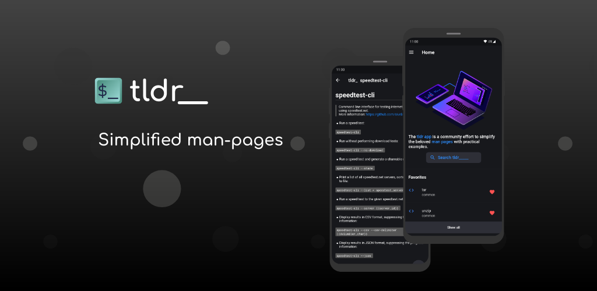
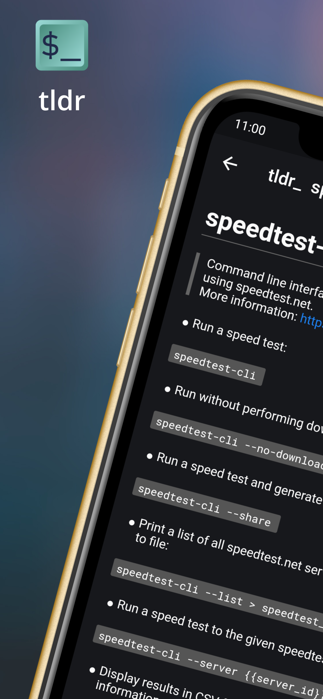

<p align="center">
  <a href="https://technodisaster.wtf/">
    
  </a>

  <p align="center">
    <a href="https://github.com/Techno-Disaster/tldr-flutter/issues/new?template=bug_report.md">Report bug</a>
    ·
    <a href="https://github.com/Techno-Disaster/tldr-flutter/issues/new?template=feature_request.md">Request feature</a>
  </p>
</p>

## Table of contents

- [Overview](#overview)
- [Screenshots](#screenshots)
- [CI](#CI)
- [Build and run](#build-and-run)
- [Bugs and feature requests](#bugs-and-feature-requests)
- [Contributing](#contributing)
- [Creators](#creators)
- [Copyright and license](#copyright-and-license)

## Overview

[](https://play.google.com/store/apps/details?id=wtf.technodisaster.tldr) (Under review)

The tldr-pages project is a collection of community-maintained help pages for command-line tools, that aims to be a simpler, more approachable complement to traditional man pages.

Maybe you are new to the command-line world? Or just a little rusty? Or perhaps you can't always remember the arguments to lsof, or tar?

It certainly doesn't help that the first option explained in man tar is:
```
-b blocksize
Specify the block size, in 512-byte records, for tape drive I/O.
```
 
This app is just that: an ever-growing collection of examples for the most common UNIX, Linux, macOS, SunOS and Windows command-line tools.

## Screenshots

||||||
|---|---|---|---|---|


### CI

#### TODO:
- [ ] Add travis with fastlane here
- [ ] Integrate github releases in the same travis script

## Build and run
* Assuming this is your first project, install [flutter](https://flutter.dev/docs/get-started/install)
* Clone this project using the url or ssh and cd into the cloned directory
* Get the dependencies with ``` flutter pub get ```
* Run the app in debug mode with ``` flutter run ```

## Bugs and feature requests

[Please open a new issue](https://github.com/Techno-Disaster/tldr-flutter/issues/new?template=bug_report.md).

## Contributing

Currently open to all contributions. Hit those issue and PR buttons.

## Creators
Jayesh Nirve
- <https://github.com/Techno-Disaster>
- <https://technodisaster.wtf>

<a href='https://ko-fi.com/T6T23OMP7' target='_blank'></a>

#### Or just use the sponser button on Github

### Thanks

* [tldr pages](https://github.com/tldr-pages/tldr) for the logo.
* [Hotpot.ai](https://github.com/HotpotDesign) for the screenshot templates and graphics generator
* [Cas van Luijtelaar](https://flare.rive.app/a/cvl/files/flare/site-animaton/embed) for the flare url

## Copyright and license

Code released under the [MIT License](https://github.com/Techno-Disaster/tldr-flutter/blob/master/LICENSE).

